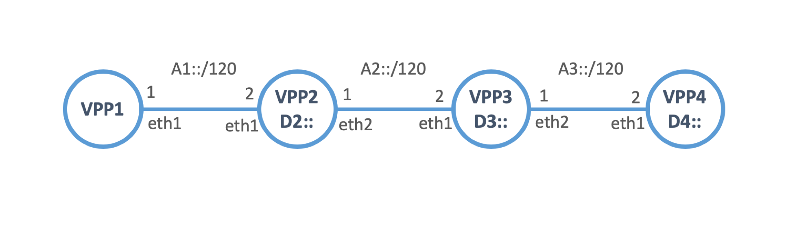
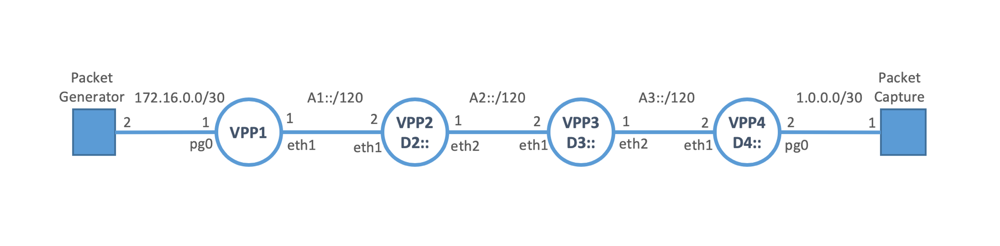
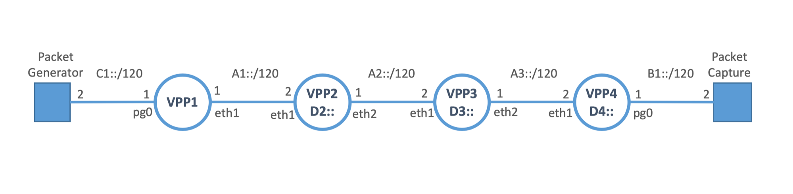

SRv6 Mobile User Plane Plugin for VPP
========================

## Introduction

This fork of VPP implements stateless mobile user plane protocols translation between GTP-U and SRv6.
The functions of the translation take advantage of SRv6 network programmability.
[SRv6 Mobile User Plane](https://tools.ietf.org/html/draft-ietf-dmm-srv6-mobile-uplane) defines the user plane protocol using SRv6
including following stateless translation functions:

- **T.M.GTP4.D:**  
   GTP-U over UDP/IPv4 -> SRv6
- **End.M.GTP4.E:**  
   SRv6 -> GTP-U over UDP/IPv4
- **End.M.GTP6.D:**   
   GTP-U over UDP/IPv6 -> SRv6
- **End.M.GTP6.E:**  
   SRv6 -> GTP-U over UDP/IPv6

These functions benefit user plane(overlay) to be able to utilize data plane(underlay) networks properly. And also it benefits
data plane to be able to handle user plane in routing paradigm.

## Getting started
To play with SRv6 Mobile User Plane on VPP, you need to install following packages:

	docker
	python3
	pip3

	Python packages (use pip):
	docker
	scapy
	jinja2


### Quick-start

1. Build up the docker container image as following:

```
$ git clone https://github.com/filvarga/srv6-mobile.git
$ cd ./srv6-mobile/extras/ietf105
$ ./runner.py infra build

$ docker images
REPOSITORY          TAG                 IMAGE ID            CREATED             SIZE
ietf105-image       latest              577e786b7ec6        2 days ago          5.57GB
ubuntu              18.04               4c108a37151f        4 weeks ago         64.2MB

```

The runner script [runner.py](https://github.com/filvarga/srv6-mobile/blob/ietf105-hackathon/extras/ietf105/runner.py) has features to automate configurations and procedures for the test.

2. Instantiate test Scenario

Let's try following command to instantiate a topology:

```
$ ./runner.py infra start
```

This command instantiates 4 VPP containers with following topology:



You can check the instantiated docker instances with "docker ps".


```
$ docker ps
CONTAINER ID        IMAGE               COMMAND                  CREATED              STATUS              PORTS               NAMES
44cb98994500        ietf105-image       "/bin/sh -c 'vpp -c …"   About a minute ago   Up About a minute                       hck-vpp-4
6d65fff8aee9        ietf105-image       "/bin/sh -c 'vpp -c …"   About a minute ago   Up About a minute                       hck-vpp-3
ad123b516b24        ietf105-image       "/bin/sh -c 'vpp -c …"   About a minute ago   Up About a minute                       hck-vpp-2
5efed405b96a        ietf105-image       "/bin/sh -c 'vpp -c …"   About a minute ago   Up About a minute                       hck-vpp-1

```

You can login to and configure each instantiated container.

```
$ ./runner.py cmd vppctl 0

Verified image: None
connecting to: hck-vpp-1
    _______    _        _   _____  ___
 __/ __/ _ \  (_)__    | | / / _ \/ _ \
 _/ _// // / / / _ \   | |/ / ___/ ___/
 /_/ /____(_)_/\___/   |___/_/  /_/    

vpp#
```

### Test Scenarios
#### SRv6 Drop-in for GTP-U/UDP/IPv4



IPv4 payload over GTP-U:

```
$ ./runner.py test tmap
```

IPv6 payload over GTP-U:

```
$ ./runner.py test tmap_ipv6
```

#### SRv6 Drop-in for GTP-U/UDP/IPv6



IPv4 payload over GTP-U:

```
$ ./runner.py test gtp6_drop_in
```

IPv6 payload over GTP-U:

```
$ ./runner.py test gtp6_drop_in_ipv6
```


#### SRv6 from GTP-U/UDP/IPv6

IPv4 payload over GTP-U:

```
$ ./runner.py test gtp6
```

IPv6 payload over GTP-U:
```
$ ./runner.py test gtp6_ipv6
```

## More information
TBD
