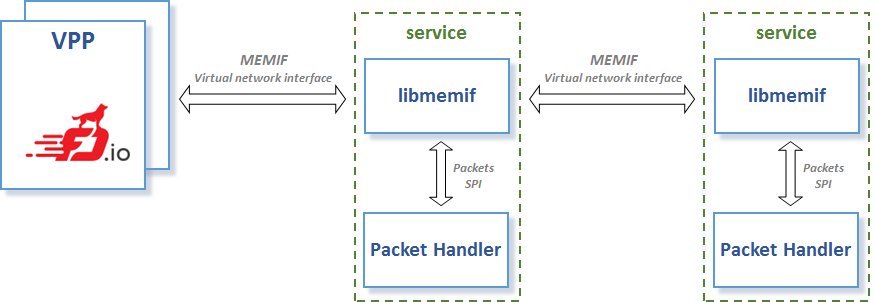

Shared Memory Packet Interface (memif) Library
==============================================
## Introduction

Shared memory packet interface (memif) provides high performance packet transmit and receive between user application and Vector Packet Processing (VPP) or multiple user applications. Using libmemif, user application can create shared memory interface in master or slave mode and connect to VPP or another application using libmemif. Once the connection is established, user application can receive or transmit packets using libmemif API.



## Features

- [x] Slave mode
  - [x] Connect to VPP over memif
  - [x] ICMP responder example app
- [x] Transmit/receive packets
- [x] Interrupt mode support
- [x] File descriptor event polling in libmemif (optional)
  - [x] Simplify file descriptor event polling (one handler for control and interrupt channel)
- [x] Multiple connections
- [x] Multiple queues
  - [x] Multi-thread support
- [x] Master mode
	- [ ] Multiple regions (TODO)
- [ ] Performance testing (TODO)

## Quickstart

This setup will run libmemif ICMP responder example app in container. Install [docker](https://docs.docker.com/engine/installation) engine.
Useful link: [Docker documentation](https://docs.docker.com/get-started).

Pull image:
```
# docker pull ligato/libmemif-sample-service
```

Now you should be able to see ligato/libmemif-sample-service image on your local machine (IMAGE ID in this README may be outdated):
```
# docker images
REPOSITORY                       TAG                 IMAGE ID            CREATED              SIZE
ligato/libmemif-sample-service   latest              32ecc2f9d013        About a minute ago   468MB
...
```

Run container:
```
# docker run -it --rm --name icmp-responder --hostname icmp-responder --privileged -v "/run/vpp/:/run/vpp/" ligato/libmemif-sample-service
```
Example application will start in debug mode. Output should look like this:
```
ICMP_Responder:add_epoll_fd:204: fd 0 added to epoll
MEMIF_DEBUG:src/main.c:memif_init:383: app name: ICMP_Responder
ICMP_Responder:add_epoll_fd:204: fd 4 added to epoll
LIBMEMIF EXAMPLE APP: ICMP_Responder (debug)
==============================
libmemif version: 1.0 (debug)
memif version: 256
commands:
	help - prints this help
	exit - exit app
	conn <index> - create memif (slave-mode)
	del  <index> - delete memif
	show - show connection details
	ip-set <index> <ip-addr> - set interface ip address
	rx-mode <index> <qid> <polling|interrupt> - set queue rx mode
```

Continue with [Example setup](examples/ExampleSetup.md) which contains instructions on how to set up conenction between icmpr-epoll example app and VPP-memif.

#### Next steps

- [Build instructions](docs/BuildInstructions.md) Instructions on how to build/install libmemif.
- [Examples](examples/README.md) More example apps presenting different features.
- [Getting started](docs/GettingStarted.md) Introduction to libmemif API. Explaining library usage in custom app.
