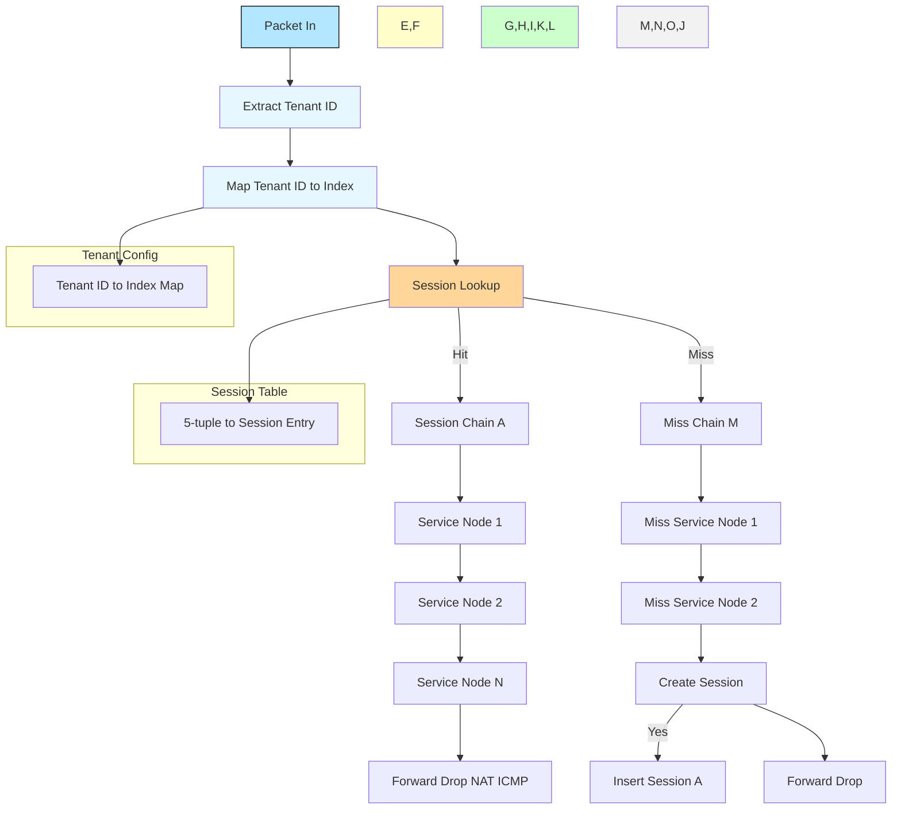

# VPP Session Aware Service Chaining (SASC)

## Overview

The Session Aware Service Chaining (SASC) plugin for VPP provides a high-performance, session-aware packet processing framework that enables dynamic service chaining based on session state and tenant configuration. SASC maintains session state across packet flows and applies different service chains based on session lookup results, protocol type, and tenant configuration.

## Architecture

SASC implements a multi-tenant, session-aware service chaining architecture with the following key components:

### Core Components

1. **Session Management**: Maintains session state using 5-tuple keys (source/destination IP, ports, protocol) with bidirectional flow tracking
2. **Tenant Configuration**: Multi-tenant support with per-tenant service chain configuration
3. **Service Chain Engine**: Dynamic service chain execution based on session state and protocol
4. **Lookup Engine**: High-performance session lookup using bihash tables
5. **Sensor Framework**: Extensible sensor services for protocol analysis and monitoring

### Data Flow Architecture



## Session Architecture

### Session States

SASC maintains session state with the following lifecycle:

- **FSOL (First Seen on Link)**: Initial session state when first packet is seen
- **ESTABLISHED**: Active session with bidirectional traffic
- **TIME_WAIT**: Session in time-wait state after connection termination
- **TCP_TRANSITORY**: TCP session in transient state (handshake, teardown)
- **TCP_ESTABLISHED**: Fully established TCP connection
- **STATIC**: Static session (no timeout)
- **EXPIRED**: Session that has exceeded timeout

### Session Key Structure

```c
typedef struct {
    ip46_address_t src;      // Source IP address
    ip46_address_t dst;      // Destination IP address
    u32 proto : 8;           // Protocol (TCP, UDP, etc.)
    u32 context_id : 24;     // Tenant context ID
    u16 sport;               // Source port
    u16 dport;               // Destination port
} sasc_session_key_t;
```

### Session Data Structure

Each session maintains:
- **Flow Statistics**: Bytes and packets per direction (forward/reverse)
- **Timing Information**: Creation time, last heard time
- **Service Chain Assignment**: Per-direction service chain indices
- **Tenant Association**: Tenant index for multi-tenancy
- **State Management**: Current session state and version tracking

## Service Chaining Architecture

### Service Chain Types

SASC supports three types of service chains per tenant:

1. **Forward Chain**: Applied to packets in the forward direction
2. **Reverse Chain**: Applied to packets in the reverse direction
3. **Miss Chain**: Applied when no session is found (first packet)

### Protocol-Aware Chaining

Services can be configured with protocol masks to control which protocols they apply to:

- **SASC_PROTO_GROUP_ALL**: Protocol-agnostic services (default)
- **SASC_PROTO_GROUP_TCP**: TCP-specific services

### Service Registration Framework

Services register themselves using the `SASC_SERVICE_DEFINE` macro:

```c
SASC_SERVICE_DEFINE(service_name) = {
    .node_name = "sasc-service-name",
    .protocol_mask = SASC_PROTO_MASK_TCP,  // Optional protocol restriction
    .depends_on = SASC_SERVICES("dependency1", "dependency2"),
    .conflicts_with = SASC_SERVICES("conflicting_service"),
    .runs_after = SASC_SERVICES("prerequisite_service"),
};
```

## Sensor Features

SASC provides an extensible sensor framework with the following services:

### TCP-Check Sensor

**Purpose**: Comprehensive TCP protocol analysis and anomaly detection

**Features**:
- **TCP State Machine Tracking**: Full TCP connection state monitoring
- **Retransmission Detection**: Identifies packet retransmissions with configurable thresholds
- **RTT Calculation**: Round-trip time measurement using TCP timestamps
- **Window Size Monitoring**: Tracks TCP window size changes
- **Fast Retransmit Detection**: Identifies TCP fast retransmit events (3 duplicate ACKs)
- **Reorder Detection**: Detects out-of-order packet delivery
- **Protocol Violation Detection**: Identifies malformed TCP headers and flags
- **Handshake Analysis**: Monitors TCP three-way handshake completion
- **Connection Teardown Tracking**: Monitors FIN/RST packet handling
- **Anomaly Counting**: Tracks various TCP anomalies and violations
- **RTT Histogram**: Maintains RTT distribution statistics
- **Bidirectional Flow Analysis**: Separate tracking for forward and reverse flows
- **Session State Persistence**: Maintains TCP state across packet processing

**Configuration Options**:
- Retransmit detection threshold (seconds)
- Reorder tolerance (sequence numbers)
- RTT calculation methods (with/without timestamps)

### PCAP Sensor

**Purpose**: Packet capture and analysis for debugging and monitoring

**Features**:
- **Service Chain Integration**: Can be added to any SASC service chain
- **Protocol Agnostic**: Works with all protocols (TCP, UDP, ICMP, etc.)
- **Configurable Capture**: Set filename, packet limits, and capture parameters
- **CLI Management**: Start, stop, and monitor capture via CLI commands
- **Test Integration**: Automatic PCAP capture during test execution
- **Standard PCAP Format**: Generates libpcap-compatible files
- **Statistics Tracking**: Monitors packets processed, captured, and bytes captured
- **Thread Safety**: Proper locking for multi-threaded operation

**Configuration Options**:
- Capture filename
- Maximum packet count
- Packet size limits
- Capture session management

### L4-Lifecycle Sensor

**Purpose**: Layer 4 connection lifecycle management

**Features**:
- **Session Establishment**: Tracks session state transitions
- **Bidirectional Flow Management**: Handles forward and reverse flow establishment
- **State Persistence**: Maintains session state across packet processing
- **Flow Direction Detection**: Identifies packet direction for proper chain application

## Multi-Tenancy Support

SASC provides comprehensive multi-tenant support:

### Tenant Configuration

Each tenant can be configured with:
- **Context ID**: Unique identifier for tenant isolation
- **Service Chains**: Separate forward, reverse, and miss chains
- **Protocol Support**: Protocol-specific service chain configuration

### Tenant Management

```c
typedef struct {
    u32 context_id;                    // Tenant context identifier
    u32 service_chains[SASC_SERVICE_CHAIN_N]; // Per-direction service chains
} sasc_tenant_t;
```

## Performance Features

### High-Performance Lookup

- **Bihash Tables**: Uses VPP's optimized bihash for session lookup
- **Thread-Local Storage**: Session data stored per-thread for optimal performance
- **Cache-Line Optimization**: Session structures aligned for cache efficiency
- **Lock-Free Operations**: Minimal locking for high-throughput packet processing

### Scalability

- **Fixed Pool Allocation**: Pre-allocated session pools prevent memory fragmentation
- **Efficient Memory Layout**: Optimized data structures for cache performance
- **Multi-Threading Support**: Full support for VPP's multi-threaded architecture
- **Session Expiry**: Automatic cleanup of expired sessions

## Configuration and Management

### CLI Commands

```bash
# Configure service chains
set sasc services <chain_id> <service1> <service2> ...

# Configure tenants
set sasc tenant <tenant_idx> context-id <context_id> \
    forward-chain <chain_id> reverse-chain <chain_id> miss-chain <chain_id>

# Show configuration
show sasc services
show sasc tenants
show sasc sessions

# Session management
clear sasc sessions
```

### API Support

SASC provides comprehensive API support for:
- Service chain configuration
- Tenant management
- Session monitoring
- Statistics collection
- Sensor configuration

## Use Cases

1. **Network Security**: Session-aware firewall and intrusion detection
2. **Load Balancing**: Stateful load balancing with session persistence
3. **Traffic Analysis**: Protocol analysis and anomaly detection
4. **Debugging**: Packet capture and session state monitoring
5. **Multi-Tenant Networks**: Isolated service chains per tenant
6. **Protocol Optimization**: Protocol-specific service optimization
