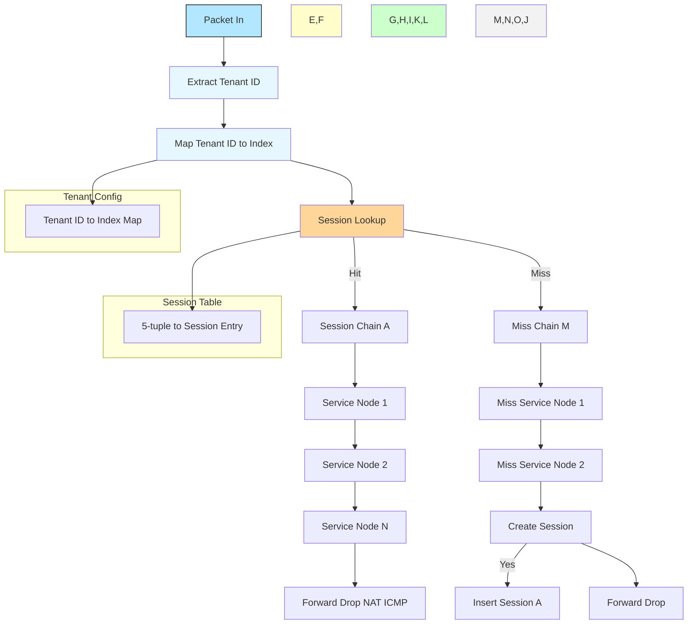

# VPP Session Aware Service Chaining

## Overview

## Architecture

```mermaid
flowchart TD
    A[Packet In] --> B[Extract Tenant ID]
    B --> C[Map Tenant ID to Index]
    C --> D[Session Lookup]
    
    D -->|Hit| E[Session Chain A]
    D -->|Miss| F[Miss Chain M]

    E --> G[Service Node 1]
    G --> H[Service Node 2]
    H --> I[Service Node N]
    I --> J[Forward Drop NAT ICMP]

    F --> K[Miss Service Node 1]
    K --> L[Miss Service Node 2]
    L --> M[Create Session]
    M -->|Yes| N[Insert Session A]
    M --> O[Forward Drop]

    subgraph T[Tenant Config]
      C1[Tenant ID to Index Map]
    end

    subgraph S[Session Table]
      C2[5-tuple to Session Entry]
    end

    C --> C1
    D --> C2

    style A fill:#b3e6ff,stroke:#000
    style B fill:#e6f7ff
    style C fill:#e6f7ff
    style D fill:#ffd699
    style E,F fill:#ffffcc
    style G,H,I,K,L fill:#ccffcc
    style M,N,O,J fill:#f2f2f2
```
