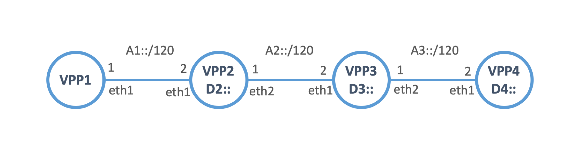
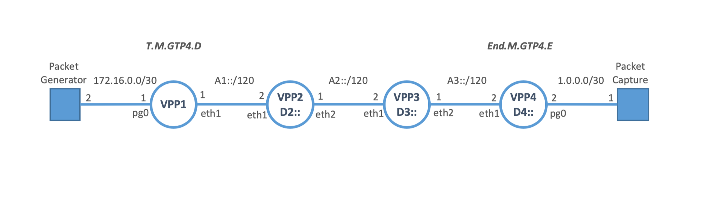
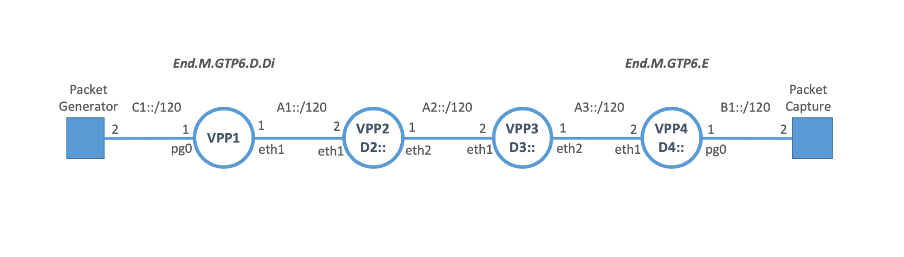
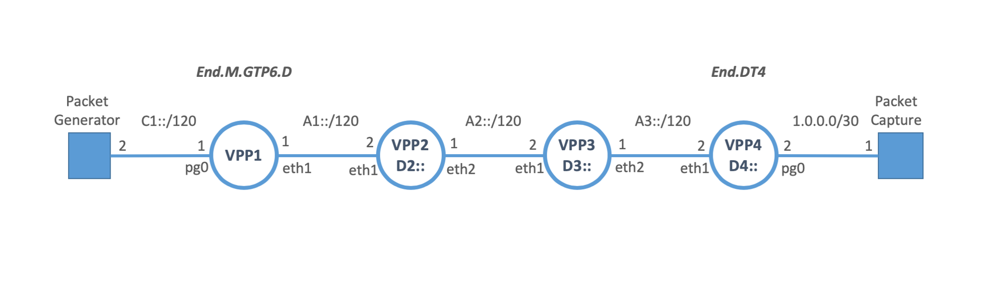
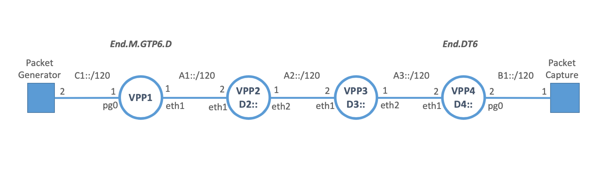

SRv6 Mobile User Plane Plugin for VPP
========================

## Introduction

This plugin module can provide the stateless mobile user plane protocols translation between GTP-U and SRv6.
The functions of the translation take advantage of SRv6 network programmability.
[SRv6 Mobile User Plane](https://tools.ietf.org/html/draft-ietf-dmm-srv6-mobile-uplane) defines the user plane protocol using SRv6
including following stateless translation functions:

- **T.M.GTP4.D:**  
   GTP-U over UDP/IPv4 -> SRv6
- **End.M.GTP4.E:**  
   SRv6 -> GTP-U over UDP/IPv4
- **End.M.GTP6.D:**   
   GTP-U over UDP/IPv6 -> SRv6
- **End.M.GTP6.E:**  
   SRv6 -> GTP-U over UDP/IPv6

These functions benefit user plane(overlay) to be able to utilize data plane(underlay) networks properly. And also it benefits
data plane to be able to handle user plane in routing paradigm.

## Getting started
To play with SRv6 Mobile User Plane on VPP, you need to install following packages:

	docker
	python3
	pip3

	Python packages (use pip):
	docker
	scapy
	jinja2


### Quick-start

1. Build up the docker container image as following:

```
$ git clone https://github.com/filvarga/srv6-mobile.git
$ cd ./srv6-mobile/extras/ietf105
$ ./runner.py infra build

$ docker images
REPOSITORY          TAG                 IMAGE ID            CREATED             SIZE
ietf105-image       latest              577e786b7ec6        2 days ago          5.57GB
ubuntu              18.04               4c108a37151f        4 weeks ago         64.2MB

```

The runner script [runner.py](test/runner.py) has features to automate configurations and procedures for the test.

2. Instantiate test Scenario

Let's try following command to instantiate a topology:

```
$ ./runner.py infra start
```

This command instantiates 4 VPP containers with following topology:



You can check the instantiated docker instances with "docker ps".


```
$ docker ps
CONTAINER ID        IMAGE               COMMAND                  CREATED              STATUS              PORTS               NAMES
44cb98994500        ietf105-image       "/bin/sh -c 'vpp -c …"   About a minute ago   Up About a minute                       hck-vpp-4
6d65fff8aee9        ietf105-image       "/bin/sh -c 'vpp -c …"   About a minute ago   Up About a minute                       hck-vpp-3
ad123b516b24        ietf105-image       "/bin/sh -c 'vpp -c …"   About a minute ago   Up About a minute                       hck-vpp-2
5efed405b96a        ietf105-image       "/bin/sh -c 'vpp -c …"   About a minute ago   Up About a minute                       hck-vpp-1

```

You can login to and configure each instantiated container.

```
$ ./runner.py cmd vppctl 0

Verified image: None
connecting to: hck-vpp-1
    _______    _        _   _____  ___
 __/ __/ _ \  (_)__    | | / / _ \/ _ \
 _/ _// // / / / _ \   | |/ / ___/ ___/
 /_/ /____(_)_/\___/   |___/_/  /_/    

vpp#
```

## Test Scenarios
### SRv6 Drop-in between GTP-U tunnel

This test scenario introduces SRv6 path between GTP-U tunnel transparently. A GTP-U packet sent out from one end to another is translated to SRv6 and then back to GTP-U. All GTP-U tunnel identifiers are preserved in IPv6 header and SRH.


#### GTP-U over UDP/IPv4 case

This case uses SRv6 end functions, T.M.GTP4.D and End.M.GTP4.E.



VPP1 is configured with "T.M.GTP4.D", and VPP4 is configured with "End.M.GTP4.E". Others are configured with "End". The packet generator sends a GTP-U packet over UDP/IPv4 toward the packet capture. VPP1 translates it to SRv6 toward D4::TEID with SR policy <D2::, D3::> in SRH. VPP4 translates the SRv6 packet to the original GTP-U packet and send out to the packet capture.

To start this case with IPv4 payload over GTP-U, you can run:

```
$ ./runner.py test tmap
```

If you want to use IPv6 payload instead of IPv4, you can run:

```
$ ./runner.py test tmap_ipv6
```


#### GTP-U over UDP/IPv6 case

This case uses SRv6 end functions, End.M.GTP6.D.Di and End.M.GTP6.E.



VPP1 is configured with "End.M.GTP6.D.Di", and VPP4 is configured with "End.M.GTP4.E". Others are configured with "End". The packet generator sends a GTP-U packet over UDP/IPv6 toward D:: of the packet capture. VPP1 translates it to SRv6 toward D:: with SR policy <D2::, D3::, D4::TEID> in SRH. VPP4 translates the SRv6 packet to the original GTP-U packet and send out to the packet capture.

To start this case with IPv4 payload over GTP-U, you can run:

```
$ ./runner.py test gtp6_drop_in
```

If you want to use IPv6 payload instead of IPv4, you can run:

```
$ ./runner.py test gtp6_drop_in_ipv6
```


### GTP-U to SRv6

This test scenario demonstrates GTP-U to SRv6 translation. A GTP-U packet sent out from one end to another is translated to SRv6.

#### GTP-U over UDP/IPv6 case

##### IPv4 payload

This case uses SRv6 end functions, End.M.GTP6.D and End.DT4.



VPP1 is configured with "End.M.GTP6.D", and VPP4 is configured with "End.DT4". Others are configured with "End". The packet generator sends a GTP-U packet over UDP/IPv6 toward D::2. VPP1 translates it to SRv6 toward the IPv6 destination consists of D4:: and TEID of GTP-U with SR policy <D2::, D3::> in SRH. VPP4 decapsulates the SRv6 packet and lookup the table for the inner IPv4 packet and send out to the packet capture.

To start this case, you can run:

```
$ ./runner.py test gtp6
```

##### IPv6 payload

This case uses SRv6 end functions, End.M.GTP6.D and End.DT6.




The configurations are same with IPv4 payload case, except D4:: is configured as "End.DT6" in VPP4. VPP4 decapsulates the SRv6 packet and lookup the table for the inner IPv6 packet and send out to the packet capture.

If you want to use IPv6 payload instead of IPv4, you can run:

```
$ ./runner.py test gtp6_ipv6
```

## More information
TBD
